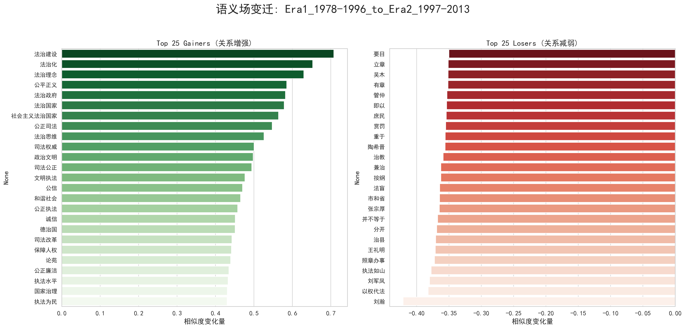
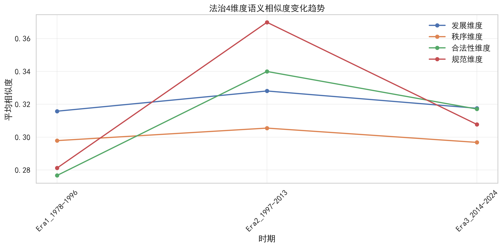
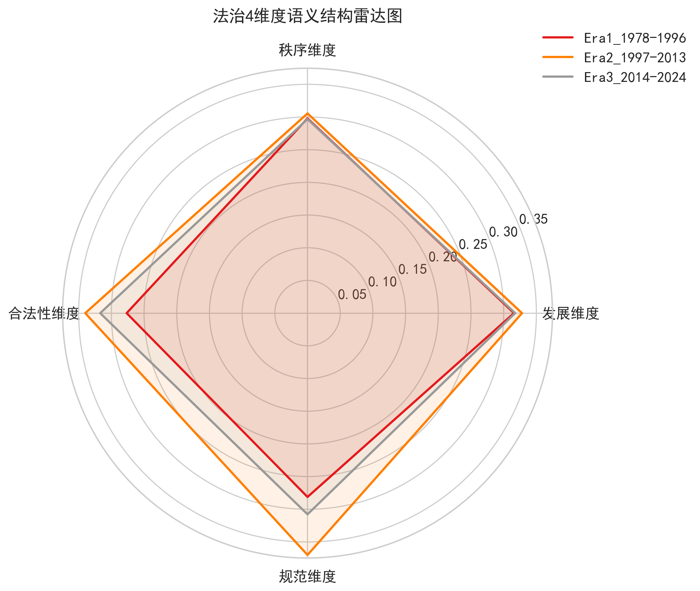
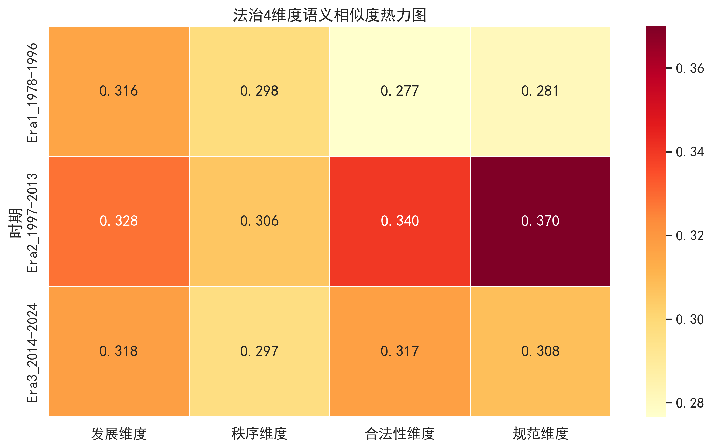
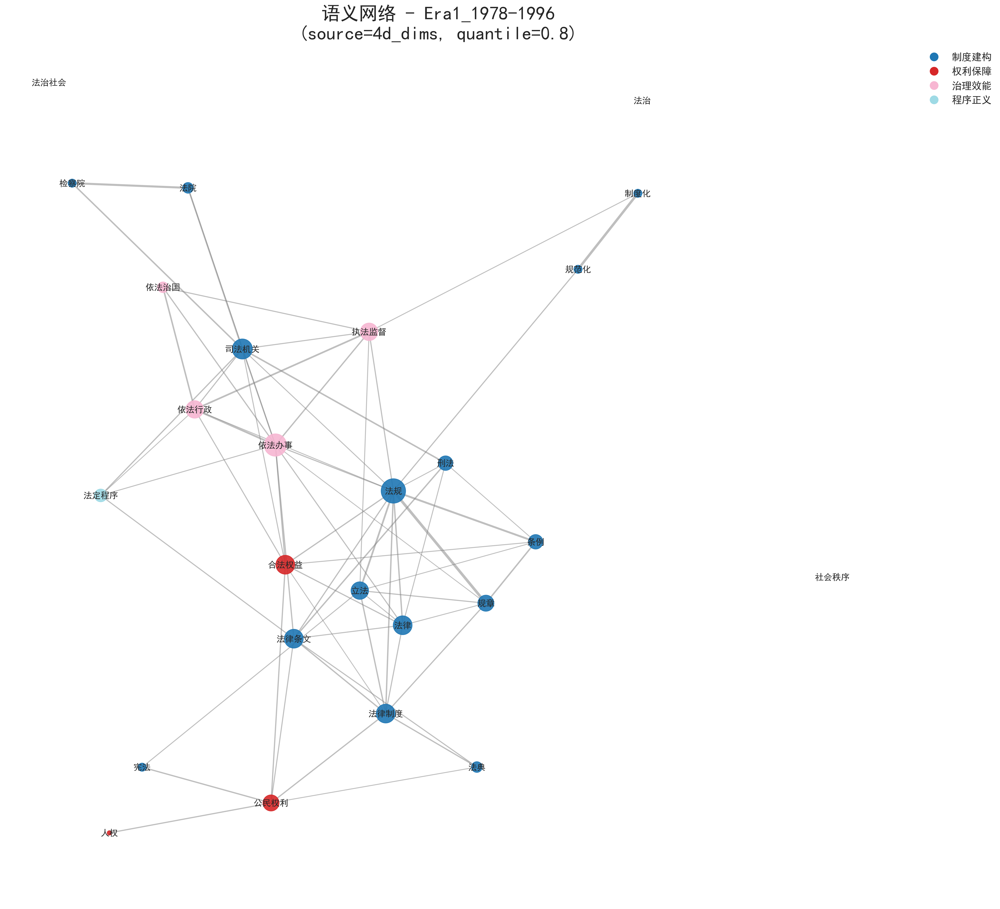

# “法治”概念语义演变分析项目：技术说明与结果解读

为了让分析更贴近真实的法学语境，我们特别设计了两个可供您直接修改的“配置”模块：
>
> 1.  **定义“核心圈”：** 在 `similar_words/` 目录下，存放着 `Era1_1978-1996_final.txt` 这样的文件。您可以直接编辑这些文件，**定义在每个历史时期，您认为与“法治”最相关的核心词汇集合**。我们的分析将基于您的定义，探索这些核心概念的演变。
> 2.  **定义“分析维度”：** 在 `topic_word/` 目录下，存放着 `dimension_words_4d.txt` 这样的文件。您可以根据您的理论框架，**将“法治”的内涵解构为不同的维度，并将每个维度下的代表性词汇填入此文件**。
>
> 您的任何修改都会直接影响后续的计算结果，使我们的定量分析与您的定性洞察紧密结合。在报告的每个部分，我们都提出了具体问题，期待获得您的宝贵意见。

---

### 第一部分：核心概念的语义演变分析 (`change_analysis`)

**1. 分析目标**

我们首先想回答一个宏观的问题：在三个关键的历史时期（**1978-1996年**，**1997-2013年**，**2014-2024年**），“法治”这个词的“朋友圈”（即语义密切相关的词群）发生了怎样的变化？哪些词在某个时期与“法治”关系紧密，而在另一个时期则有所疏远？

**2. 技术方法详解**

该分析基于 **词嵌入（Word Embedding）** 技术，特别是 **Word2Vec** 模型。该技术能将每个词语映射到一个高维向量空间中（即一张“意义地图”）。在这个空间里，语义相近的词，其向量表示也更为接近。我们通过计算词向量之间的 **余弦相似度（Cosine Similarity）** 来量化它们之间的“语义距离”。

我们为三个历史时期分别训练了独立的词向量模型。通过比较“法治”一词在不同时期模型中与其“邻居”词汇的余弦相似度变化，我们就能精确追踪其内涵的演变。

**3. 初步结果**

我们产出了一系列图表来展示这些变化。以下图表对比了两个相邻时代之间，哪些词与“法治”的关联度显著增强（“Gainer”）或减弱（“Loser”）。

*   **语义变化趋势图** (`output/change_analysis_v2/`):
    *   **策略1：基于模型Top-N词** - 直接从各时期模型中，选取与“法治”余弦相似度最高的N个词作为候选词库，观察其变化。
        
        

    *   **策略2：基于维度定义词** - 从您在 `dimension_words_4d.txt` 等文件中定义的维度词包中寻找候选词。
        
        

    *   **策略3：基于专家定义词** - 从您在 `similar_words/` 目录下定义的各时期核心词包中寻找候选词。
        
        

**4. 需要您的帮助**

解读这些词汇的变化，离不开您的专业判断。
*   **问题1**：请您审阅图中的“Gainers”和“Losers”列表。这些词汇的变迁，是否符合您对这几个时期国家法治建设重点、立法思想、社会背景变化的认知？
*   **问题2**：这些词汇的变迁，是否能对应到某些标志性的法律事件或政策转向？例如，“市场经济”、“依法治国”等理念的提出。

---

### 第二部分：“法治”内涵的维度探索 (`clustering_analysis`)

**1. 分析目标**

“法治”是一个内涵丰富的复杂概念。我们希望不仅仅停留在观察零散的“邻居”词，而是尝试将这些词汇系统性地归纳为几个核心的“维度”或“主题”。这有助于我们建立一个更清晰、更有条理的分析框架。

**2. 技术方法详解**

我们使用了 **K-Means 聚类算法**。该算法能自动将词向量空间中（“意义地图”上）位置相近的词语划分到同一个簇（Cluster）中。您可以把它想象成一个自动化的“星座识别”过程：算法将所有与“法治”相关的词汇看作天上的星星，自动将那些靠得近的星星（词汇）划分成不同的“星座”（词语簇）。每一个“星座”，就可能代表“法治”内涵的一个潜在维度。我们分别尝试了将其划分为 **3个**、**4个**及**5个**簇的方案。

为了在二维平面上展示高维空间中的聚类结果，我们采用了 **t-SNE (t-distributed Stochastic Neighbor Embedding)** 降维技术，它尤其擅长保持数据的局部结构，能清晰地呈现聚类的边界。

**3. 初步结果**

*   **聚类结果文件**:
    *   *文件位置: `output/clustering_analysis/cluster_results_3d.txt`, `..._4d.txt`, `..._5d.txt`*
    *   这些文件详细列出了在不同维度方案下，每个簇内具体包含哪些词汇。

*   **聚类可视化图** (`output/clustering_analysis/`):
    *   在这些图中，每一个点代表一个词，颜色相同的点被算法归为同一个簇。这可以帮助我们直观地感受这些维度的边界和内部紧密度。
    *   **3维度方案**:
        
    *   **4维度方案**:
        
    *   **5维度方案**:
        

**4. 需要您的帮助**

算法只能识别语义距离，无法诠释法学意义。
*   **问题3**：请您审查这几种聚类方案。您认为3、4、5维度的划分中，哪一种更能揭示“法治”概念的内在结构？
*   **问题4**：您能否根据每个簇内的词汇构成，为它们赋予一个具有法学理论意义的名称？例如，某个聚类可能代表“**制度建设**”，另一个可能代表“**司法实践**”，或是“**权利保障**”等。您的命名将成为我们后续分析的基石。

---

### 第三部分：法治维度的历时演变分析 (`dimension_analysis`)

**1. 分析目标**

在识别出“法治”的核心维度后（无论是通过聚类发现还是专家定义），我们想进一步探究：在不同的历史时期，这些维度的相对重要性是如何变化的？是“制度建设”一直占据主导，还是“权利保障”的地位在后期逐渐上升？

**2. 技术方法详解**

我们基于您在 `topic_word/` 文件夹中定义的维度词表进行分析。对于每个时期，我们都量化计算了“法治”一词的词向量与该时期每个维度下所有词汇的词向量的 **平均余弦相似度**。这个平均值越高，说明该维度在当时与“法治”的整体关联越强，也即“热度”越高。

**3. 初步结果**

我们为每个维度方案都生成了一套图表，保存在 `output/dimension_analysis/` 目录下。

*   **趋势图 (Trend Chart)**:
    *   
    *   展示了每个维度与“法治”的关联度随三个时期的变化曲线，便于观察特定维度的兴衰。

*   **雷达图 (Radar Chart)**:
    *   
    *   将不同时期的维度结构置于同一坐标系下，直观地比较各时期“法治”内涵的整体“形状”和侧重点。如果某个时期的雷达图在某个维度上特别突出，说明那个时期“法治”的内涵更偏向该维度。

*   **热力图 (Heatmap)**:
    *   
    *   用颜色的深浅清晰地展示了每个维度在每个时期的“热度”（平均余弦相似度），便于进行跨时期和跨维度的精确比较。

**4. 需要您的帮助**

*   **问题5**：这些图表揭示的趋势（例如，某个维度在特定时期显著增强或减弱）是否符合您的预期和学术观察？
*   **问题6**：能否请您结合具体的历史背景，解读这些维度重要性变化背后的原因？

---

### 第四部分：语义网络分析 (`network_analysis`)

**1. 分析目标**

之前的分析主要关注“法治”与周边词的“一对多”关系。但我们还想了解这些周边词彼此之间是如何连接的，从而形成一个复杂的“语义关系网”。这有助于我们识别出网络中的**核心概念（Hubs）**和**桥梁概念（Bridges）**。

**2. 技术方法详解**

我们将词汇关系建模为一种 **图（Graph）** 或 **网络**。每个词是一个**节点（Node）**，如果两个词的余弦相似度超过一个设定的阈值，它们之间就存在一条**边（Edge）**。
*   **节点大小（Node Size）**: 代表该节点在网络中的重要性，通常用 **度中心性（Degree Centrality）** 来衡量，即一个词连接的其他词越多，它就越核心，点也越大。
*   **边的权重（Edge Weight）**: 代表两个词的相似度，关系越近，线越粗。
*   **阈值设定**: 为避免网络过于稠密，我们仅显示相似度排在前 **20%** 的词语关系。这个阈值可以调整。

**3. 初步结果**

*   **语义网络图** (`output/network_plots_v3/`):
    *   我们为每个时期、基于不同词汇策略都绘制了网络图。图中，一个点代表一个词，点的大小代表其中心性，线的粗细代表关系远近，颜色代表算法识别出的不同“语义社群”。
    *   **注意**：我们计算了所有词对的相似度，仅当两个词的相似度高到足以进入所有相似度排名的**前20%**时（即 quantile > 0.8，这个数值可调），才在它们之间连接一条边。

    *   **策略1：基于模型Top-N词** - 网络节点源于各时期模型中与“法治”最相似的80个词。
        
        
        

    *   **策略2：基于维度定义词** - 网络节点源于您在 `dimension_words_4d.txt` 文件中定义的维度词包。
        
        
        

    *   **策略3：基于专家定义词** - 网络节点源于您在 `similar_words/` 目录下定义的各时期核心词包。
        
        
        

**4. 需要您的帮助**

*   **问题7**：请您观察这些网络图。图中那些尺寸较大的核心节点，是否确实是您认为在对应时期法治语境下的关键概念？
*   **问题8**：您是否能发现一些连接了不同颜色社群的“桥梁词汇”？这些词汇在连接不同法律部门或理论议题上，可能扮演了重要的角色。

